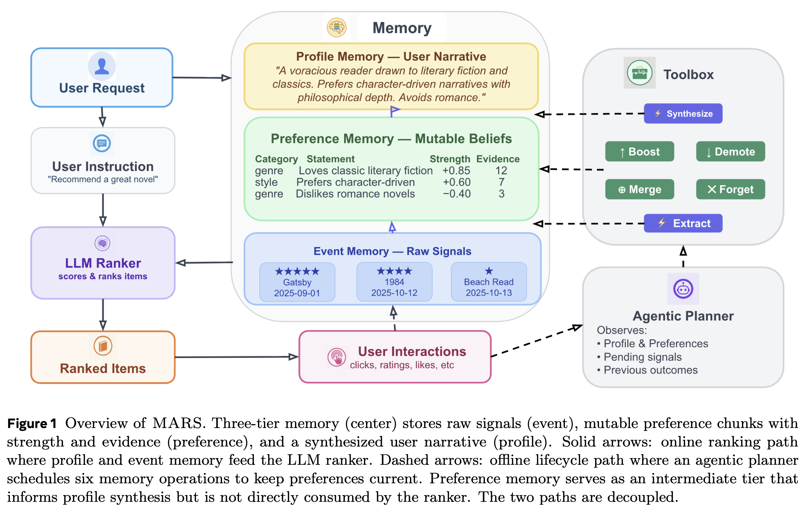
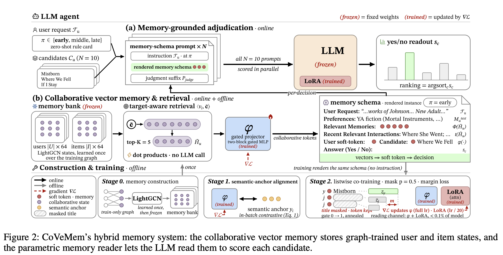
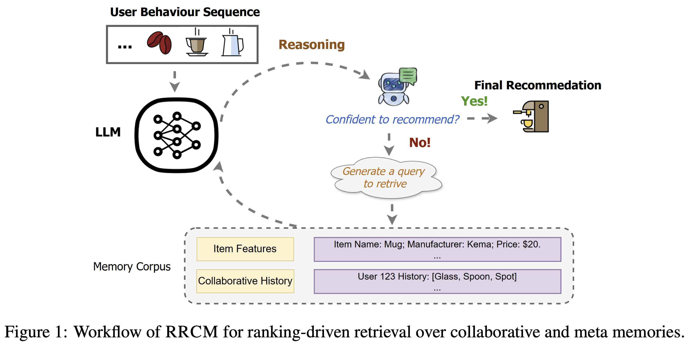

# Paper Index

| Paper | 动机 | 方法 | 什么有用 | Year | Venue | Link |
|---|---|---|---|---|---|---|
| MARS | 平铺式文本 memory 将短期行为与稳定偏好混合，并且没有memory生命周期 | 提出了分层的memory，分别包含最近历史记录，短期/长期兴趣。每次inference的时候会先通过Extract整理memory，同时根据memory进行推荐。 |  | 2026.05 | arXiv | [Paper](https://arxiv.org/abs/2605.14401) · [Notes](papers/MARS.md) |
| AMEM4Rec | 现有的工作只制作了user自己的memory，没有考虑到协同的东西 | 创建了一个memory池。让llm能够使用当前user的memory去检索内存池中的shared memory。shared memory创建方法为生成所有的user memory，相似度最高的一对送入llm生成合并后的memory。 |  | 2026.02 | arXiv | [Paper](https://arxiv.org/abs/2602.08837) · [Notes](papers/AMEM4Rec.md) |
| CoVeMem | 如果像MemRec一样去做text memory是很浪费token的 | 使用embedding代替text去做memory：1. 首先用CF训练了一个embedding表征user和item；2. 把这个embedding对齐到LLM emb的宽度；3. 继续训练projector+LLM lora（使用了LLM listwise loss） |  | 2026.08 | arXiv | [Paper](https://arxiv.org/abs/2608.26895) · [Notes](papers/CoVeMem.md) |
| AgenticRec | 不训练的LLM agent是没法自己根据情况调用工具的 | ReAct Agent: 使用GRPO去做两阶段训练：1. 在所有样本生成不同trajectory做GRPO；2. 在hard-neg sample上生成不同trajectory做GRPO。工具包括：*user info, item info, CF info, 交互统计信息* |  | 2026.03 | arXiv | [Paper](https://arxiv.org/abs/2603.21613) · [Notes](papers/AgenticRec.md) |
| RRCM | 作者认为如果将所有东西都塞到context会让模型困惑，不如让模型自己从memory挑选 | ReAct Agent: 设置seq memory和item memory，使用GRPO train了一个LLM，让LLM学会怎么调用memory，相当于AgenticRec（2603.21613）的青春版 |  | 2026.05 | arXiv | [Paper](https://arxiv.org/abs/2605.07129) · [Notes](papers/RRCM.md) |

