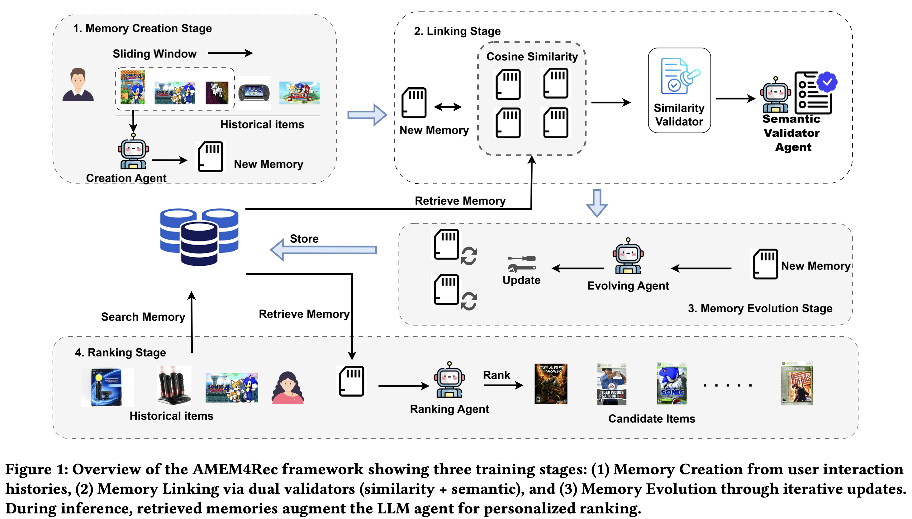

# AMEM4Rec — Leveraging Cross-User Similarity for Memory Evolution in Agentic LLM Recommenders

- **Year:** 2026
- **Venue:** arXiv
- **Paper:** https://arxiv.org/abs/2602.08837
- **Drive note:** https://docs.google.com/document/d/1mELwwpYXBjRUTa8KBBkkauFBAeDV5B7Y7A3OnI-IqWU/edit


## TLDR

现有的Agent依靠额外的CF模型提供协同能力，或直接没有协同能力。作者不训练LLM，将每个用户独立的 memory 扩展为一个共享的跨用户 memory pool，通过 memory evolution 聚合相似用户的偏好模式。




## Motivation

很多 agentic LLM recommender 依赖自然语言用户记忆，但主要利用语义信息，缺少推荐系统中关键的跨用户 collaborative signal。AMEM4Rec 希望不依赖预训练 CF backbone，而是让不同用户的行为模式在一个全局 memory pool 中相互连接、合并和演化。


## Method


### Train

```
用户历史
   |
   v
LLM Memory Extraction
   |
   v
每个用户一个 memory
   |
   v
Memory Pool
   |
   v
Cross-user Memory Evolution
   |
   v
Global Collaborative Memory
```

其中后半部分：

**Embedding memory**

`e_k = SBERT(一个user的memory)`

比对所有memory的similarity，如果相似的话就去做：

**Cross-user Memory Evolution**

把两个相似的user memory输入到LLM
```
Two users have similar preference memories.

Memory A:
...

Memory B:
...

Please generate a shared preference pattern.
```

LLM会输出一个新的描述综合了两个Memory。于是就变成了：**<u>固定个user specific memory + 不固定个shared memory</u>**


### Inference

<u>**输入了一个user，先生成user memory；之后用memory embedding检索shared memory，再把这些拼到prompt中让LLM输出**</u>

最终prompt：

```
User history:

Adidas shoes
Apple watch


User memory:

fitness enthusiast


Relevant community memories:

Outdoor fitness users usually like:
Garmin watches

Candidates:

1. Garmin watch
2. Camera
3. Laptop


Rank candidates.
```

