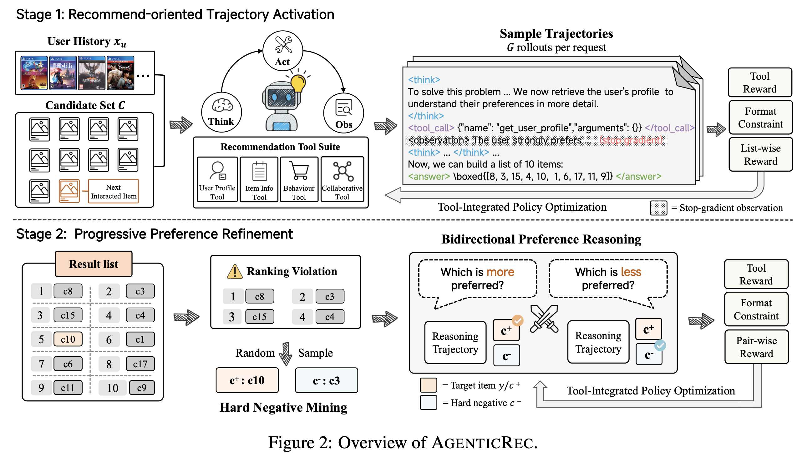

# AgenticRec — A Recommendation-Oriented Agentic Framework with Progressive Tool-Integrated Reasoning Optimization

- **Year:** 2026
- **Venue:** arXiv
- **Paper:** https://arxiv.org/abs/2603.21613
- **Drive note:** https://docs.google.com/document/d/1kY43TuZrvWZYTMqGa7b9nC35IMX-nF-wAQIRbaKqYRg/edit

## TLDR

这篇文章不是<u>让模型走一次得到结果</u>的推荐，而是React风格的\[Think1→Act1→Obs1→Think2→Act2→Obs2→⋯→Rec\]的推荐。

## Motivation

1. 现有 recommender agent 即使能够调用工具，但是都是不训练的，理论上有可能不对齐。

2. LLM 自己只有 language prior，但推荐真正重要的还有很多东西，比如 collaborative signal、用户统计行为、item metadata 等。

作者要train一个会自己调用工具的llm，实现react agent

## Method

### Agent Structure

<u>系统中心是一个 **Qwen3-4B-Instruct-2507**，属于 single-agent ReAct-style framework。</u>

一次推荐中可以反复执行：

`Think → Act → Observation → Think → Act → Observation → ... → Recommendation`

四类外部工具：

1. **User Profile Tool**：长期用户画像；
2. **Item Information Tool**：候选 metadata 与集合分析；
3. **Behavioral Statistics Tool**：近期类别、session interest、rating statistics；
4. **Collaborative Information Tool**：通过训练集上的 SASRec embeddings 检索相似用户/物品。

这些 tool 不是独立 agent，只是外部函数/服务。

### Training Preparation

在 RL 前先准备：

1. 在 Amazon train split 上<u>训练 SASRec</u>，建立 collaborative retrieval space；

2. 用同系列 Qwen <u>离线生成用户 profile</u>；

3. <u>建立 metadata query tool；</u>

4. <u>建立行为统计 tool；</u>

5. 把交互转换成 1 positive + 19 negatives 的 ranking task。

### Stage 1: RTA — Recommendation-Oriented Trajectory Activation

<u>这里主要就是用了GRPO去实现模型更新</u>

#### Rollout

<u>对同一个 request 采样 `G=8` 条 trajectory</u>。不同 rollout 可以：

- 调不同工具；
- 形成不同 Think；
- 得到不同 Top-10。

单条 trajectory 最多调用 10 次工具。

#### Ranking Reward

若格式合法且 positive 进入 Top-10，则 reward 使用 positive 所在位置对应的 NDCG@10。

例如只有一个 positive 时：

- rank 1 → reward 1.0
- rank 2 → ~0.631
- rank 3 → 0.5

*若 positive 不在 Top-10：`-0.5`；格式非法或 tool budget 超限：`-1`。如果 positive rank=1 且至少调用一次工具，还有额外 `+0.1`。*

#### GRPO

同一 request 的 8 条 trajectory 计算组内 baseline，简化优势可写为：

`A(g) = R(g) - mean(R)`

高于组均值的轨迹被增强，低于组均值的被抑制。RTA 训练 3 epochs。

### Stage 2: PPR — Progressive Preference Refinement

<u>第一次是在所有样本都去做了GRPO，但这样准确率可能没那么高，所以**再需要做一次hard neg sample上的GRPO**</u>

#### Hard-Negative Mining

如果 positive `c+` 不是第 1：

- 将排在 `c+` 前面的 candidates 作为 hard-negative pool；
- 若 `c+` 不在 Top-10，则将整个 Top-10 作为 pool；
- 从中采样一个 `c-`，形成 hard pair `(c+, c-)`。

这是一种 self-bootstrapped / on-policy hard-negative mining：

`current policy → ranking violation → hard pair → further training`

论文实际报告的是一轮 PPR（1 epoch），并没有持续多轮“重挖—再训练”。

#### Bidirectional Preference Task

同一个 hard pair 被改写成两个 prompt：

- positive direction：哪个更可能被用户选择？正确答案 `c+`
- negative direction：哪个更不可能被用户选择？正确答案 `c-`

两个任务仍允许 Think + tools + Observation。

#### PPR Still Uses GRPO

PPR 没有直接计算 BPR / hinge / logistic loss。

它仍然采样 trajectory，并用二元 reward：

- correct = 1
- wrong = 0

然后继续 GRPO 更新 LLM policy。

论文理论里出现的 pairwise logistic expression 主要是解释双向训练，不是实现中的直接 supervised loss。

### 这种ReAct的trajectory是怎么训练的

rollout 完成后，系统已有完整 transcript：

`[Prompt, Think1, Act1, Obs1, Think2, Act2, Obs2, Rec]`

**<u>训练时将其拼成普通 causal sequence，但使用 action mask：</u>**

- <u>Prompt: mask 0</u>
- <u>Observation: mask 0</u>
- <u>Think / Act / Rec: mask 1</u>

**<u>因此可以通过一次 teacher-forcing forward 重算所有 policy token 的 log probability。</u>**

轨迹概率只包含 LLM 自己生成的部分：

`log πθ(τ) = Σ_{t:mask=1} log πθ(z_t | z_<t)`

Observation 属于 environment，只作为后续 token 的 context，不参与 policy log-prob，也不会把梯度传回 SASRec/tool。

## Experiments

论文报告在四个数据集、20 个指标中 19 个最好；唯一未第一的是 Office H@1。

消融也显示：未经训练的工具调用并不天然有用。某些数据集上 Frozen tool-integrated reasoning 甚至低于 frozen reasoning-only；经过 RTA 后工具增强才稳定变好。

PPR 在多个数据集的 H@1 上进一步提升。
